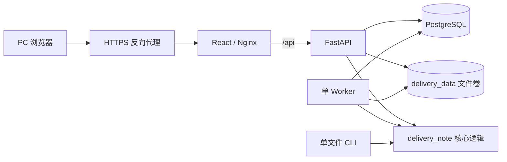

# DeliveryNote

DeliveryNote 是一个面向内部业务人员的供应链交货 Excel 处理工具。系统把供应商交货单与采购需求、商品、供应商、库位资料和导出模板进行匹配，生成可导入业务系统的标准 Excel，并保留所有需要人工判断的数量。

项目支持 Web 批次处理和单文件 CLI。Web 端适合多文件共享采购余额、异常审校和版本管理；CLI 保留单文件处理能力。

## 功能范围

- 在同一批次中按用户确认的文件顺序连续扣减采购余额；
- 自动匹配供应商、SKU、站点和目的仓；
- 保留超量、未匹配和歧义数据，支持人工守恒拆分；
- 按版本管理采购需求、商品、供应商、库位和导出模板；
- 发布不可变的超收规则，并让新批次锁定当时启用的版本；
- 导出单来源结果、多来源合并 Excel 和分文件 ZIP；
- 管理用户状态、密码和最近 200 条操作记录。

系统不向 ERP 回写，也不跨批次延续采购余额。当前部署规模是单 API、单 Worker，面向少量内部用户。

## 核心业务规则

1. 批次内的交货文件按明确顺序处理，共享同一份采购余额快照。
2. 调整文件顺序可以改变各文件获得的余额，但不能改变批次交货总量。
3. 采购状态只有 `交货中` 和 `待交货` 时才参与分配。
4. `供应商成品本地仓` 优先分配，其他仓库按名称保持稳定顺序。
5. 商品资料中的 `锁仓MKSU` 用于解决 SKU 和站点歧义。
6. 超量、未匹配和歧义数量全部进入待处理，不得丢弃。
7. 人工拆分数量必须为正整数，拆分合计必须等于原待处理数量。
8. 始终满足：`交货总量 = 可导入总量 + 待处理总量`。
9. 任一文件计算失败时，不保存该批次的部分计算结果。
10. A:G 字段、模板样式、交货备注和导出命名保持兼容。

测试数据字段错误时应修正测试数据，不应放宽正式业务逻辑。

## Web 操作流程

### 1. 准备基础资料

管理员在“管理员维护”中上传并启用以下五类 Excel：

| 类型 | 用途 |
| --- | --- |
| 采购需求 | 提供供应商、SKU、站点、目的仓和未交量 |
| 商品信息 | 建立 SKU 与完整站点的映射，并提供锁仓标识 |
| 供应商资料 | 从交货文件名识别供应商并取得正式编码 |
| 库位/排仓 | 补充待处理定位信息，并为超收规则提供规模定位 |
| 导出模板 | 定义正式导入文件的 A:G 字段和样式 |

新建批次时，系统锁定当时启用的五类资料。后续启用新版本不会改变已有批次。

库位资料有正式版本后，更新必须走服务器草稿流程：开始网页维护、编辑或整表替换、校验、确认警告并发布。发布会创建新的不可变版本，不覆盖旧文件。

### 2. 创建和计算批次

```text
创建批次 → 上传交货文件 → 调整顺序 → 预检 → 后台计算
```

批次至少需要一份交货文件。计算前可以删除错传文件或调整顺序；任何文件变动都会要求重新预检。预检检查 Excel 结构、基础资料完整性和供应商识别结果。

Worker 按顺序处理全部文件。任务使用数据库租约和心跳，超时任务会重新排队；失去租约的旧 Worker 不能覆盖新任务结果。

### 3. 审校和导出

计算完成后，页面显示交货总量、可导入量和待处理量。待处理记录可以按来源、SKU、站点、规模定位、备货定位和异常原因筛选。

人工拆分的每一部分可以标记为：

- 可正式导入：必须有目的仓、供应商编码、SKU 和唯一完整站点；
- 继续保留待处理：随导出文件进入待处理工作表。

修改拆分后，已有导出会失效，需要重新生成。多文件批次会同时生成合并 Excel 和分文件 ZIP；单文件批次直接下载对应结果。

## 文件约定

### 交货文件

- 文件格式为 `.xls` 或 `.xlsx`；
- 工作表名称为 `汇总`；
- 表头位于第 2 行或第 4 行；
- 必须有且仅有一个名称以 `SKU` 结尾的字段；
- 至少有一个名称以“站”结尾的站点列；
- 交货数量必须是正整数；
- 同一批次不能上传两个同名文件。

文件名还承担供应商识别和备注生成，必须满足：

- 以 6 位日期开头；
- 包含一个已启用供应商名称，且能够唯一识别；
- 包含“发货 N 箱”或“交货 N 箱”。

系统生成的单据备注格式为：`日期-供应商-批次内序号-箱数`。

### 基础资料字段

| 类型 | 工作表 | 必要字段 |
| --- | --- | --- |
| 采购需求 | 第一张工作表 | `单据状态`、`供应商`、`SKU`、`平台站点`、`目的仓`、`未交量` |
| 商品信息 | 第一张工作表 | `SKU`、`店铺/站点`、`品类A`、`锁仓MKSU` |
| 供应商资料 | 第一张工作表 | `供应商编号`、`供应商名称`、`状态` |
| 库位/排仓 | `MSKU_视图` | `店铺-站点`、`积加SKU`、`MSKU`、`规模定位`、`备货定位`、`已下单可售天数` |
| 导出模板 | 当前活动工作表 | 第 2 行为正式 A:G 表头，第 3 行提供样例和数据样式 |

`锁仓MKSU` 是当前正式字段名，不要自行改名。

库位草稿校验中，空站点、空积加 SKU 以及同一站点和 SKU 下不唯一的 MSKU 属于错误；未知规模定位、空备货定位和非数值可售天数属于警告。

### 导出内容

正式导入区域固定为 A:G：

| 列 | 字段 |
| --- | --- |
| A | `*目的仓` |
| B | `*供应商编码` |
| C | `*SKU` |
| D | `*本次交货量` |
| E | `*站点` |
| F | `单据备注` |
| G | `交货备注` |

每个来源结果包含两个工作表：

- `交货导入`：保留模板第 3 行样例，正式数据从第 4 行开始；
- `待处理导入`：使用同一套 A:G 字段，并在 H:J 增加 `规模定位`、`备货定位` 和 `已下单可售天数`。

合并 Excel 按批次来源顺序汇总。分文件 ZIP 只包含各来源的独立处理文件。

## 超收规则

系统默认不自动超收。发布或重新启用规则后，只有之后创建的批次会锁定该规则。

| 规则项 | 处理方式 |
| --- | --- |
| 版本 | 发布后不可修改；配置变化时发布新版本 |
| 数量 | 短尾、中尾、长尾分别设置绝对件数上限 |
| 仓库 | 使用精确白名单；空白名单表示不允许自动超收 |
| 规模定位 | 必须存在且唯一，空值、未知值或冲突不会获得超收额度 |
| 共享维度 | 同一批次的 `供应商 + SKU + 站点` 共享额度 |
| 扣减顺序 | 先扣采购未交量，再按文件顺序扣超收额度 |
| 目的仓 | 只能使用采购快照中真实存在并命中白名单的仓库 |

`admin` 和 `operator` 都可以发布或重新启用超收规则。

## 权限

| 能力 | `operator` | `admin` |
| --- | :---: | :---: |
| 登录、创建批次、上传文件、预检和计算 | ✓ | ✓ |
| 审校拆分和导出 | ✓ | ✓ |
| 查看并发布超收规则 | ✓ | ✓ |
| 查看基础资料版本 | ✓ | ✓ |
| 上传、启用和维护基础资料 | — | ✓ |
| 创建、停用用户和重置密码 | — | ✓ |
| 查看操作记录 | — | ✓ |

登录会话有效期为 12 小时。停用账号或重置密码会立即删除该用户已有会话。修改 `.env` 中的初始管理员密码不会重置数据库中已存在的账号。

## 系统结构



- React 提供 PC Web 界面，生产构建由 Nginx 托管；
- FastAPI 负责鉴权、版本、批次、草稿和审校接口；
- Worker 负责批次计算和导出；
- PostgreSQL 保存账号、版本、批次、任务和审计元数据；
- `delivery_data` 卷保存基础资料、上传文件和导出结果；
- Web、API、Worker 和 CLI 共用 `delivery_note` 中的处理逻辑。

主要目录：

| 路径 | 内容 |
| --- | --- |
| `delivery_note/` | Excel 处理、匹配、批次应用服务和 CLI |
| `delivery_note/web/` | API、鉴权、数据库模型和库位草稿 |
| `delivery_note/worker.py` | 计算、导出、任务租约和超时恢复 |
| `frontend/src/` | React 页面、接口封装和前端测试 |
| `tests/` | 后端、核心逻辑和备份测试 |
| `scripts/` | 验收数据生成和成对备份脚本 |
| `ops/systemd/` | 未启用的备份服务与定时器示例 |
| `.github/workflows/ci.yml` | GitHub Actions 质量检查 |

## Docker 部署

### 环境要求

- Linux 主机；
- Git；
- Docker Engine 和 Docker Compose 插件；
- 正式环境使用 Nginx 或其他 HTTPS 反向代理。

Compose 使用 PostgreSQL 17、Python 3.11 和单 API/单 Worker。Web 端口只绑定宿主机回环地址 `127.0.0.1`。

### 环境变量

复制 `.env.example` 为 `.env`：

| 变量 | 必填 | 默认值 | 用途 |
| --- | :---: | --- | --- |
| `POSTGRES_PASSWORD` | 是 | 无 | PostgreSQL 业务账号密码 |
| `ADMIN_USERNAME` | 否 | `admin` | 首次建库时创建的管理员用户名 |
| `ADMIN_PASSWORD` | 是 | 无 | 首次建库时创建的管理员密码 |
| `WEB_PORT` | 否 | `8080` | 宿主机回环地址上的 Web 端口 |
| `CORS_ORIGINS` | 否 | `http://localhost:8080` | 允许访问 API 的来源，多个值用逗号分隔 |
| `MAX_UPLOAD_BYTES` | 否 | `20971520` | 单个上传文件大小上限，单位为字节 |
| `IMPORT_CANDIDATE_TTL_SECONDS` | 否 | `900` | 库位整表替换预览的有效秒数 |
| `POSITION_FRAME_CACHE_SIZE` | 否 | `8` | API 进程缓存的库位版本数量 |

`.env` 含有凭据，不得提交到 Git。

### 首次启动

```bash
git clone https://github.com/songtu2025/deliverynote.git
cd deliverynote
cp .env.example .env
# 编辑 .env 后执行
docker compose config
docker compose up -d --build
docker compose ps
curl http://127.0.0.1:8080/health
```

健康检查成功时返回：

```json
{"status":"ok"}
```

如果修改了 `WEB_PORT`，请替换健康检查命令中的端口。

### 更新已有环境

```bash
git pull --ff-only
docker compose build api worker web
docker compose run --rm api python -m delivery_note.migrations.overreceipt_rules
docker compose up -d
docker compose ps
curl http://127.0.0.1:8080/health
```

超收规则迁移可重复执行，用于给已有数据库补充规则表和待处理分配字段。新数据库会由 API 启动时的 SQLAlchemy `create_all()` 创建当前表结构。

停止服务但保留数据：

```bash
docker compose down
```

不要执行 `docker compose down -v`，它会删除 PostgreSQL 和业务文件卷。

## 本地开发

建议使用 Python 3.11 和 Node.js 22。

### 安装后端依赖

```bash
python -m venv .venv
# Linux/macOS
source .venv/bin/activate
# Windows PowerShell
# .\.venv\Scripts\Activate.ps1
python -m pip install -r requirements-dev.txt
```

依赖文件的实际关系：

- `requirements.txt` 是 Docker 镜像安装的 Python 依赖清单；
- `requirements-dev.txt` 通过 `-r requirements.txt` 继承该清单，再安装固定版本的 Ruff；
- 前端依赖由 `frontend/package.json` 声明，并通过 `frontend/package-lock.json` 锁定。

### 启动开发环境

终端一，启动 API：

```powershell
$env:ADMIN_USERNAME="admin"
$env:ADMIN_PASSWORD="replace-with-a-local-password"
python -m uvicorn delivery_note.web.api:create_app --factory --reload
```

未提供 `DATABASE_URL` 和 `STORAGE_ROOT` 时，API 使用仓库根目录下的 `delivery_note.db` 和 `storage/`。

终端二，启动 Worker：

```bash
python -m delivery_note.worker
```

终端三，启动前端：

```bash
cd frontend
npm ci
npm run dev
```

开发服务器地址为 `http://localhost:5173`，Vite 会把 `/api` 和 `/health` 代理到 `http://127.0.0.1:8000`。

## 单文件 CLI

```bash
python -m delivery_note.cli \
  --delivery /path/to/delivery.xlsx \
  --purchase /path/to/purchase.xlsx \
  --product-info /path/to/product.xlsx \
  --supplier-info /path/to/supplier.xlsx \
  --position-data /path/to/position.xlsx \
  --template /path/to/template.xlsx \
  --output-dir outputs
```

CLI 每次处理一份交货文件，默认按北京时间创建输出目录。多份文件需要共享采购余额时必须使用 Web 批次流程。CLI 当前不应用 Web 中发布的超收规则。

## 验证与 CI

后端和核心逻辑：

```bash
python -m ruff check delivery_note tests scripts
python -m unittest discover -s tests -v
python -m pip check
```

前端：

```bash
cd frontend
npm ci
npm run test
npm run build
```

Compose 配置：

```bash
docker compose config
git diff --check
```

生成脱敏验收数据：

```bash
python scripts/generate_acceptance_data.py --output-dir acceptance_data
```

基准场景是两份交货文件各 80 件、采购未交 100 件：

| 场景 | 预期结果 |
| --- | --- |
| 不启用超收 | `160 = 100 可导入 + 60 待处理`；第一份获得 80，第二份获得 20 |
| 短尾额度 50 且仓库命中白名单 | `160 = 150 可导入 + 10 待处理` |

`acceptance_data/` 只用于本地验收，不提交到 Git。

GitHub Actions 会在 Pull Request 和 `master` 推送时执行 Ruff、后端测试、前端测试与构建、Python 依赖检查和 Compose 配置校验。CI 不连接生产环境，也不自动部署。

## 备份

`scripts/backup_deliverynote.py` 会成对备份 PostgreSQL 和 `delivery_data` 文件卷。备份期间会停止 Web 和 API，等待活动任务结束后停止 Worker，校验备份，再恢复服务，因此必须安排维护窗口。

先检查环境：

```bash
python3 scripts/backup_deliverynote.py \
  --compose-file compose.yaml \
  --env-file .env \
  --project-name deliverynote \
  --destination /srv/backups/deliverynote \
  --check-only
```

确认后去掉 `--check-only` 创建备份。每个完整备份包含：

- `database.dump`；
- `delivery_data.tar.gz`；
- `BACKUP-METADATA.json`、`SHA256SUMS` 和 `READY`。

`ops/systemd/` 中的文件只是部署示例，仓库不会自动启用定时备份。当前也没有自动恢复脚本；启用定时器前应先在隔离环境验证人工恢复流程和异机保存策略。

## 数据安全与当前边界

- 不提交 `.env`、密码、Token、业务 Excel、数据库、日志、上传文件或导出结果；
- 正式环境必须通过 HTTPS 访问；
- 业务文件保存在 Docker 数据卷，数据库和文件卷必须成对备份；
- 不因技术清理删除历史业务批次；
- 不删除或重建生产数据卷；
- 时间在数据库和 API 中使用 UTC，页面统一显示北京时间；
- 库位整表替换预览 Token 保存在单个 API 进程内；
- 当前只维护 PC Web，不承诺手机端、多租户、开放平台或高可用集群；
- 只有实际使用规模或业务要求变化时，才调整单 API、单 Worker 架构。

项目协作和修改约束见 `AGENTS.md`。
