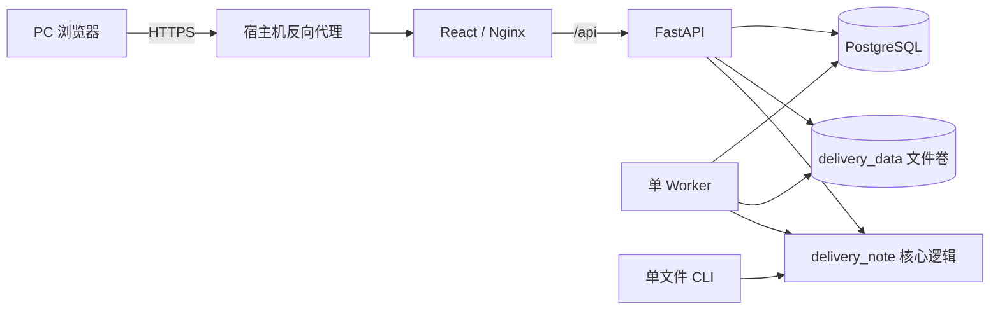

# DeliveryNote

> 面向少量内部操作人员的供应链交货 Excel 处理工具。

| 文档属性 | 说明 |
| --- | --- |
| 文档状态 | 维护中，作为仓库级产品与工程入口 |
| 适用读者 | 业务操作人员、管理员、开发维护人员、部署维护人员 |
| 适用范围 | PC 浏览器与兼容的单文件 CLI；预计并发使用人数不超过 5 人 |
| 规范来源 | 本文定义稳定产品契约；运行状态以实际部署、代码与自动化测试结果为准 |
| 更新要求 | 业务规则、权限、文件契约、部署依赖或系统边界变化时同步更新 |

## 1. 产品概述

DeliveryNote 将供应商交货单与采购需求、商品、供应商、库位和导出模板进行匹配，生成：

- 可导入业务系统的标准 Excel；
- 因超量、未匹配或歧义而需要人工审校的数据；
- 多文件批次的合并结果或逐文件 ZIP。

Web 端支持一个批次内处理多份交货单。文件严格按照用户确认的顺序共享并连续消耗采购余额，避免各文件独立计算造成采购数量被重复占用。原有 CLI 保留单文件处理能力。

该项目的目标是可靠地完成一项边界明确的内部工作，而不是建设通用供应链平台。

### 1.1 适用场景

- 少量内部用户在 PC 端处理供应商交货 Excel；
- 同一批次的多份交货单需要共享采购余额；
- 异常数量需要保留、筛选和人工拆分；
- 基础资料和超收规则需要版本化并可追溯；
- 结果需要保持既有 A:G 模板、样式、备注和命名兼容。

### 1.2 明确不做

- 不向 ERP 或其他外部业务系统回写；
- 不跨批次延续采购余额扣减；
- 不建设手机端专项界面；
- 不提供多租户、复杂组织权限或开放平台能力；
- 当前规模不引入 Redis、Celery、微服务、集群或高可用编排。

## 2. 业务契约

以下规则属于产品级不变量。任何实现、重构和界面调整都不得绕过这些约束。

| 编号 | 契约 |
| --- | --- |
| `BIZ-001` | 同一批次按用户确认的文件顺序共享并连续扣减采购余额。 |
| `BIZ-002` | 调整文件顺序可以改变余额归属，但不能改变批次交货总量。 |
| `BIZ-003` | 超量、未匹配和歧义数量必须完整进入待处理，不得丢弃。 |
| `BIZ-004` | 始终满足 `交货总量 = 可导入总量 + 待处理总量`。 |
| `BIZ-005` | 供应商成品本地仓优先；其他仓库保持确定性顺序。 |
| `BIZ-006` | 商品锁仓标识继续用于解决 SKU 与站点歧义。 |
| `BIZ-007` | 人工拆分的每个数量必须为正，拆分总和必须等于原待处理数量。 |
| `BIZ-008` | 任一文件计算失败时，不得持久化该批次的部分计算结果。 |
| `BIZ-009` | CLI、A:G 字段、模板样式、交货备注和导出命名保持兼容。 |
| `BIZ-010` | 不跨批次保存采购扣减状态，不执行 ERP 回写。 |

测试数据字段损坏时，应修正测试数据；不得通过放宽正式逻辑来兼容错误列名。

## 3. 功能边界

### 3.1 批次处理

- 创建批次并锁定当时生效的五类基础资料；
- 上传一份或多份交货文件；
- 在计算前删除错传文件并调整处理顺序；
- 预检 Excel 结构、供应商识别和必要字段；
- 由后台 Worker 进行共享余额计算；
- 查看数量摘要、来源顺序和待处理原因；
- 对待处理数量进行守恒拆分；
- 下载单来源结果、多文件合并 Excel 或分文件 ZIP。

### 3.2 管理维护

- 版本化维护采购需求、商品、供应商、库位和导出模板；
- 通过服务器草稿维护库位资料，支持校验、差异预览和原子发布；
- 发布不可变的超收规则版本；
- 维护用户状态与密码；
- 查看最近 200 条操作记录。

### 3.3 角色与权限

| 能力 | `operator` | `admin` |
| --- | :---: | :---: |
| 登录、创建和处理批次 | ✓ | ✓ |
| 查看、拆分和导出批次结果 | ✓ | ✓ |
| 发布或重新启用超收规则 | ✓ | ✓ |
| 查看批次锁定的基础资料状态 | ✓ | ✓ |
| 发布基础资料与维护库位草稿 | — | ✓ |
| 维护用户账号 | — | ✓ |
| 查看操作记录 | — | ✓ |

已停用账号不能继续使用既有登录状态。修改 `.env` 中的初始管理员密码，不会重置数据库中已经存在的账号。

## 4. 系统架构



关键设计约束：

- Web、Worker 和 CLI 共用 `delivery_note` 核心逻辑，不复制采购匹配规则；
- PostgreSQL 保存用户、版本、批次、任务和审计元数据；
- `delivery_data` 保存上传文件、中间文件和导出结果；
- Compose 固定运行单 API、单 Worker，符合当前使用规模；
- Web 端口仅绑定宿主机 `127.0.0.1`，由 HTTPS 反向代理提供正式访问。

主要代码位置：

| 路径 | 职责 |
| --- | --- |
| `delivery_note/pipeline.py` | SKU/站点匹配、采购过滤、仓库分配和超量保留 |
| `delivery_note/application.py` | 多文件共享余额、文件顺序和拆分投影 |
| `delivery_note/excel_io.py` | Excel 读取、校验与写出 |
| `delivery_note/config.py` | 供应商识别、仓库顺序和备注配置 |
| `delivery_note/web/` | API、模型、鉴权和库位草稿 |
| `delivery_note/worker.py` | 批次计算、导出、任务租约和恢复 |
| `delivery_note/cli.py` | 兼容的单文件命令行入口 |
| `frontend/src/` | React PC 操作界面 |

## 5. 处理流程

```text
准备文件 → 预检 → 计算结果 → 异常审校 → 导出下载
```

1. 管理员发布或确认五类基础资料。
2. 如业务需要，管理员或操作员发布超收规则；未发布时保持默认关闭。
3. 用户创建批次，系统锁定当时有效的基础资料和超收规则版本。
4. 用户上传交货文件、调整顺序并完成预检。
5. Worker 按顺序处理全部文件，共享采购余额与适用的超收额度。
6. 用户核对数量守恒和待处理原因，必要时进行人工拆分。
7. 用户按需要下载单文件、合并 Excel 或分文件 ZIP。

刷新 `/batches/{id}` 会恢复当前批次；浏览器前进、后退与批次 URL 保持一致。

## 6. 数据与文件契约

### 6.1 基础资料

| 类型 | 工作表或关键字段 | 用途 |
| --- | --- | --- |
| 采购需求 | `单据状态`、`供应商`、`SKU`、`平台站点`、`目的仓`、`未交量` | 确定可分配采购余额与目标仓库 |
| 商品信息 | `SKU`、`店铺/站点`、`品类A`、`锁仓MKSU` | 匹配商品、站点与规模定位 |
| 供应商 | `供应商编号`、`供应商名称`、`状态` | 根据来源文件识别供应商 |
| 库位/排仓 | 工作表 `MSKU_视图`；包含 `店铺-站点`、`积加SKU`、`MSKU` 和定位字段 | 提供备货与规模定位 |
| 导出模板 | 第 2 行为正式 A:G 表头，第 3 行保留样例数据和格式 | 约束导出字段和样式 |

交货文件使用 `汇总` 工作表。供应商通过文件名和当前供应商资料识别，不为单个供应商增加硬编码分支。

> `锁仓MKSU` 是现有正式字段名。即使拼写不常见，也不得擅自改名。

### 6.2 导出字段

正式导入区域固定为 A:G：

| 列 | 字段 |
| --- | --- |
| A | `*目的仓` |
| B | `*供应商编码` |
| C | `*SKU` |
| D | `*本次交货量` |
| E | `*站点` |
| F | `单据备注` |
| G | `交货备注` |

交货导入表保留第 3 行样例数据，正式数据从第 4 行开始。多文件合并 Excel
按批次来源顺序拼接可导入数据；分文件 ZIP 为每份来源文件保留独立工作簿；
单文件批次继续支持直接下载对应结果。

## 7. 超收规则

系统初始默认不使用超收规则。只有主动发布规则后，新建批次才锁定当时启用的版本。

| 规则项 | 处理口径 |
| --- | --- |
| 版本 | 发布后不可修改；配置变化必须发布新版本 |
| 生效范围 | 仅影响发布后创建并锁定该版本的批次 |
| 发布权限 | 所有现有 `admin` 和 `operator` 用户 |
| 额度 | 短尾、中尾、长尾分别配置允许超收的绝对件数 |
| 仓库 | 使用精确白名单；空白名单表示任何仓库都不允许超收 |
| 定位缺失 | 空、未知或多个 MSKU 定位冲突时不允许自动超收 |
| 共享维度 | 同一批次的 `供应商 + SKU + 站点` 共享额度 |
| 扣减顺序 | 先扣正常采购余额，再按文件顺序扣超收额度 |
| 仓库来源 | 仅采购快照中真实存在且命中白名单的仓库可使用 |
| 规则外数量 | 完整进入待处理，继续满足数量守恒 |

“供应商成品本地仓”是正式仓库名称。是否允许该仓库超收完全由规则白名单决定。

## 8. 时间口径

- 数据库、会话和后台任务使用 UTC；
- API 时间值返回显式 `Z` 时区；
- Web 页面统一转换为 `Asia/Shanghai`（北京时间）；
- CLI 默认按北京时间生成输出目录。

不得依赖浏览器或服务器的本地时区隐式解释业务时间。

## 9. 部署

### 9.1 前置条件

- Linux 主机；
- Git；
- Docker Engine 与 Docker Compose 插件；
- 可选的 Nginx 或其他 HTTPS 反向代理。

### 9.2 环境变量

复制 `.env.example` 为 `.env`，并按部署环境填写：

| 变量 | 必填 | 默认值 | 说明 |
| --- | :---: | --- | --- |
| `POSTGRES_PASSWORD` | 是 | 无 | PostgreSQL 业务账号密码 |
| `ADMIN_USERNAME` | 否 | `admin` | 首次建库时创建的管理员账号 |
| `ADMIN_PASSWORD` | 是 | 无 | 首次建库时创建的管理员密码 |
| `WEB_PORT` | 否 | `8080` | 宿主机回环地址上的 Web 端口 |
| `CORS_ORIGINS` | 否 | `http://localhost:8080` | 允许访问 API 的 Web 来源 |
| `MAX_UPLOAD_BYTES` | 否 | `20971520` | 单次上传大小上限，单位为字节 |
| `IMPORT_CANDIDATE_TTL_SECONDS` | 否 | `900` | 库位 Excel 导入预览的有效秒数 |
| `POSITION_FRAME_CACHE_SIZE` | 否 | `8` | API 进程缓存的库位资料版本数量 |

`.env` 包含凭据，不得提交到 Git。

### 9.3 首次启动

```bash
git clone https://github.com/songtu2025/deliverynote.git
cd deliverynote
cp .env.example .env
# 编辑 .env 后执行：
docker compose config
docker compose up -d --build
docker compose ps
curl http://127.0.0.1:8080/health
```

健康检查成功时返回：

```json
{"status":"ok"}
```

如果 `.env` 修改了 `WEB_PORT`，健康检查中的 `8080` 应替换为实际端口。

### 9.4 更新已有环境

```bash
git pull --ff-only
docker compose build api worker web
docker compose run --rm api python -m delivery_note.migrations.overreceipt_rules
docker compose up -d
docker compose ps
curl http://127.0.0.1:8080/health
```

超收规则迁移是幂等迁移，可重复执行。发布前仍需先执行配置校验、健康检查，并按变更范围完成对应测试。

停止服务并保留数据：

```bash
docker compose down
```

禁止执行 `docker compose down -v`；该命令会删除 PostgreSQL 与业务文件数据卷。

## 10. 开发与验证

建议使用 Python 3.11 和 Node.js 22。

Python 依赖分为两个清单：

- `requirements.txt` 是生产运行依赖，Docker 镜像只安装该文件；
- `requirements-dev.txt` 继承 `requirements.txt`，再加入本地开发、测试和 CI 需要的工具；
- 只被测试代码使用的包放入 `requirements-dev.txt`；生产代码直接导入的包应写入 `requirements.txt`，不要只依赖间接依赖。

后端与核心逻辑：

```bash
python3 -m venv .venv
source .venv/bin/activate
python -m pip install -r requirements-dev.txt
python -m ruff check delivery_note tests scripts
python -m unittest discover -s tests -v
python -m pip check
```

前端：

```bash
cd frontend
npm ci
npm run test
npm run build
```

编排配置：

```bash
docker compose config
git diff --check
```

仓库中的 `.github/workflows/ci.yml` 会在 PR 和 `master` 推送时自动执行
Ruff、后端测试、前端测试与构建、依赖检查和 Compose 配置校验。CI
不连接生产环境，也不自动部署。

涉及共享余额或超收规则时，还应执行脱敏业务验收：

```bash
source .venv/bin/activate
python scripts/generate_acceptance_data.py --output-dir acceptance_data
```

基准场景为两份交货文件各 80 件、采购未交 100 件：

| 场景 | 预期结果 |
| --- | --- |
| 不启用超收 | `160 = 100 可导入 + 60 待处理`；第一份 80，第二份 20 |
| 短尾额度 50 且仓库命中白名单 | `160 = 150 可导入 + 10 待处理` |

`acceptance_data/` 只用于本机验收，不得提交到 Git。当前实际测试与部署证据以对应提交、CI 结果和部署现场记录为准，不写入 README。

## 11. 单文件 CLI

```bash
python -m delivery_note.cli \
  --delivery /path/to/delivery.xlsx \
  --purchase /path/to/purchase.xlsx \
  --product-info /path/to/product.xlsx \
  --supplier-info /path/to/supplier.xlsx \
  --position-data /path/to/position.xlsx \
  --template /path/to/template.xlsx \
  --output-dir outputs
```

CLI 每次处理一份交货文件。需要在多份文件之间共享采购余额时，必须使用 Web 批次流程。

## 12. 安全与数据治理

- 不提交 `.env`、密码、Token、真实业务 Excel、数据库、日志、上传文件或导出结果；
- 正式环境必须通过 HTTPS 访问；
- 业务 Excel 和导出结果仅保存在部署数据卷；
- 停用用户或重置密码后，其既有登录状态失效；
- 不根据技术判断删除历史业务批次；
- 不删除或重建生产 Docker 数据卷；
- 当前根据业务决定不启用自动备份定时器，相关脚本仅作为未启用工具保留。

## 13. 当前工程边界

- 仅维护 PC 端；
- 单 API、单 Worker；
- 库位 Excel 导入预览 Token 保存在 API 进程内；
- 数据库主要由 SQLAlchemy `create_all()` 建表，超收规则使用独立幂等迁移；
- 操作记录只读取最近 200 条；
- GitHub Actions 只负责质量检查，生产发布继续按 Runbook 手工确认；
- 前端生产构建存在单包体积提示，但不改变当前少量内部用户的功能口径。

这些边界不是对未来扩展的承诺。只有真实使用规模或业务要求发生变化时，才评估相应架构调整。

## 14. 文档导航

| 文档 | 用途 | 主要读者 |
| --- | --- | --- |
| `AGENTS.md` | Codex 在本仓库工作的强制规则 | 自动化开发代理 |
